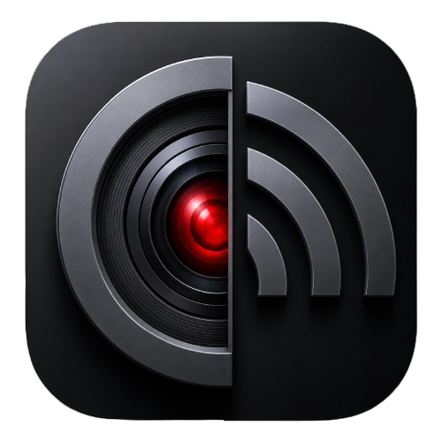
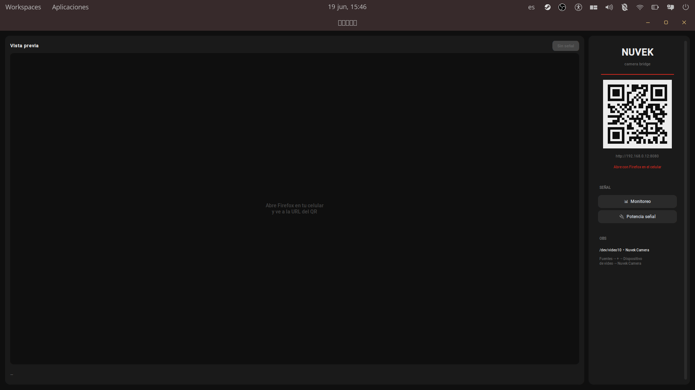
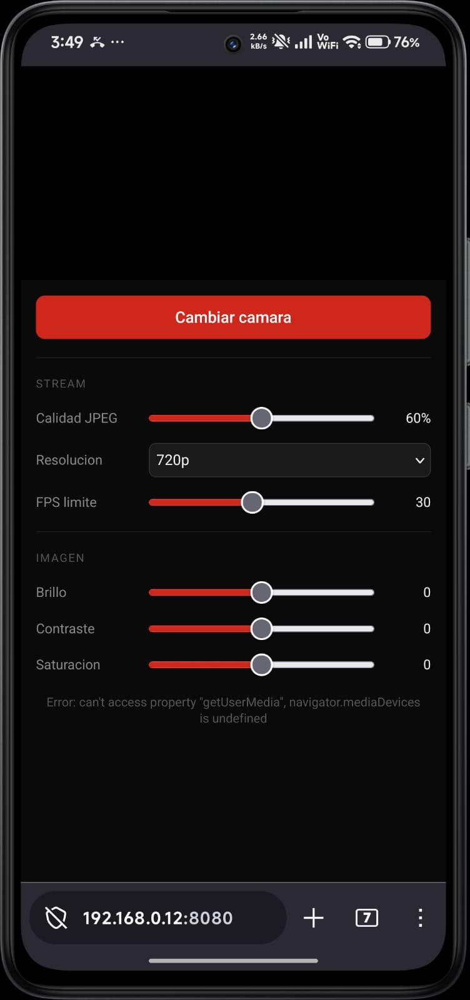

<div align="center">


&nbsp;&nbsp;&nbsp;✕&nbsp;&nbsp;&nbsp;


# NUVEK

**Convierte la cámara de tu celular en una cámara virtual para tu PC.**  
Sin apps. Sin cables obligatorios. Solo abre el navegador y transmite.

[](LICENSE)
[]()
[]()
[]()

<br/>

[](https://github.com/JUXCHXX/Nuvek/releases/latest)

</div>

---

## 📸 Vista previa

<div align="center">

**PC**



**Celular**



</div>

---

## ⚡ ¿Qué es Nuvek?

Nuvek es un **camera bridge** de código abierto para Linux que toma el video de la cámara de tu celular (vía navegador web) y lo inyecta como una cámara virtual en tu sistema (`/dev/video10`), disponible para OBS, Zoom, Meet, o cualquier app que use video.

- 📡 Transmisión por **WiFi** o **USB (ADB)**
- 🎛️ Ajustes en tiempo real: brillo, contraste, saturación, FPS, resolución
- 📊 Monitor de señal integrado
- 🎥 Compatible con **OBS Studio** y cualquier app V4L2
- 🖥️ Interfaz de escritorio elegante con **CustomTkinter**

---

## 🧩 Stack

<div align="center">

| | Tecnología | Rol |
|---|---|---|
| 🐍 | **Python 3.13** | Lenguaje principal |
| 🖥️ | **CustomTkinter** | UI de escritorio |
| 🌐 | **Flask** | Servidor HTTPS local |
| 👁️ | **OpenCV** | Procesamiento de imagen |
| 🎞️ | **ffmpeg** | Pipeline de video a V4L2 |
| 📷 | **v4l2loopback** | Cámara virtual del kernel |
| 📱 | **JavaScript (getUserMedia)** | Cliente web en el celular |
| 🔌 | **ADB** | Túnel USB opcional |

</div>

---

## 🚀 Instalación

### Requisitos

```bash
# Módulo del kernel para cámara virtual
sudo apt install v4l2loopback-dkms ffmpeg adb

# Activar el dispositivo virtual
sudo modprobe v4l2loopback devices=1 video_nr=10 card_label="Nuvek Camera" exclusive_caps=1

# Para que /dev/video10 exista automáticamente al arrancar
echo "v4l2loopback" | sudo tee /etc/modules-load.d/v4l2loopback.conf
echo 'options v4l2loopback devices=1 video_nr=10 card_label="Nuvek Camera" exclusive_caps=1' | sudo tee /etc/modprobe.d/v4l2loopback.conf
```

### Clonar y correr

```bash
git clone https://github.com/JUXCHXX/Nuvek.git
cd Nuvek

python3 -m venv venv
source venv/bin/activate
pip install -r requirements.txt

python3 main.py
```

### Instalar como app de escritorio

```bash
cp Nuvek.desktop ~/.local/share/applications/
update-desktop-database ~/.local/share/applications/
```

---

## 📖 Uso

1. Ejecuta Nuvek en tu PC
2. Escanea el QR con tu celular
3. Abre la URL en **Firefox** (requerido por permisos de cámara con HTTPS self-signed)
4. Acepta el certificado cuando Firefox lo solicite → **Avanzado → Aceptar el riesgo y continuar**
5. En OBS: **Fuentes → + → Dispositivo de video → Nuvek Camera**

### Potenciar señal con USB

```bash
# Conecta el celular por cable y ejecuta
adb reverse tcp:8080 tcp:8080
# Luego abre http://localhost:8080 en el celular
```

---

## 🗺️ Roadmap de versiones

| Versión | Estado | Novedades |
|---|---|---|
| **v1.0** | ✅ Lanzada | Camera bridge WiFi, ajustes de imagen, monitor de señal, túnel USB |
| **v1.2** | 🔧 Planeada | Audio del micrófono como fuente virtual (PipeWire), perfiles por app |
| **v2.0** | 🔧 Planeada | Soporte **Windows** con OBS Virtual Camera, instalador `.exe` |
| **v2.5** | 💡 Idea | Zoom digital, filtros (desenfoque, B&N, vintage), historial de conexiones |
| **v3.0** | 💡 Idea | App Android nativa (Kotlin) con **WebRTC**, latencia ultra baja |

---

## 🌍 Contribuir

Nuvek es libre y abierto. Si quieres portar a otra distro de Linux o a Windows, eres bienvenido.

```
📦 Estructura del proyecto
Nuvek/
├── main.py                  # Entry point
├── Nuvek.desktop            # Acceso directo de escritorio
├── nuvek/
│   ├── core/
│   │   ├── server.py        # Servidor Flask + procesamiento de frames
│   │   └── virtual_cam.py   # Pipeline ffmpeg → /dev/video10
│   └── ui/
│       └── app.py           # Interfaz CustomTkinter
└── requirements.txt
```

Pull requests bienvenidos para:
- 🪟 **Puerto a Windows** (OBS Virtual Camera / DirectShow)
- 🐧 **Otras distros** (Arch, Fedora, Debian)
- 📱 **App Android nativa** (reemplazar cliente web)
- 🔊 **Audio virtual** (PulseAudio / PipeWire)

---

## 📄 Licencia

MIT — libre para usar, modificar y distribuir.  
Si lo portás a Windows o a otra distro, menciona el proyecto original. 🤝

---

<div align="center">

Hecho con ❤️ en Colombia 🇨🇴

</div>
